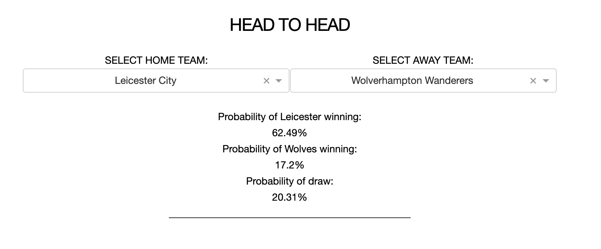

Click [here](https://oracle20.herokuapp.com/) to visit Oracle.

*Oracle* uses a form of [machine learning](https://en.wikipedia.org/wiki/Machine_learning) known as [poisson regression](https://en.wikipedia.org/wiki/Poisson_regression) to predict 
the outcome of upcoming [Premier League](https://en.wikipedia.org/wiki/Premier_League) football games based upon past event data.

Bookmaker data adjusts in real time as bets are placed in order to hedge the bookmaker's position on either side of the event. 
Popular bets where the published odds have become skewed can be identified and ranked by significance using machine learning.

*Oracle* hunts the internet for bookmaker data in the 3 major betting regions (*USA, UK and Australia*). It compares the current published odds data with the outcome of the *Oracle* machine learning engine and suggests the bets with the highest [expected value](https://en.wikipedia.org/wiki/Expected_value). The strongest bets are those with the highest integer values in the significance column and the most stars in the strength column.

*Oracle* also provides a more straightforward **head to head** demonstration mode with win/draw probabilities updated in real time.

*Oracle* is a demonstration of machine learning only and *Oracle* assumes no responsibility for the outcome of any games or bets made as a result of this engine.
*Oracle* was created by [Rory](https://www.linkedin.com/in/rory-garton-smith-5b991659/). Poisson regression for this style of problem was first suggested in papers by [David Sheehan](https://dashee87.github.io/football/python/predicting-football-results-with-statistical-modelling/) and [Erlandson F. Saraiva](https://www.researchgate.net/publication/305801126_Predicting_football_scores_via_Poisson_regression_model_applications_to_the_National_Football_League).

View the website [here](https://oracle20.herokuapp.com/).

Data updated weekly.

Head to head example shown below:

